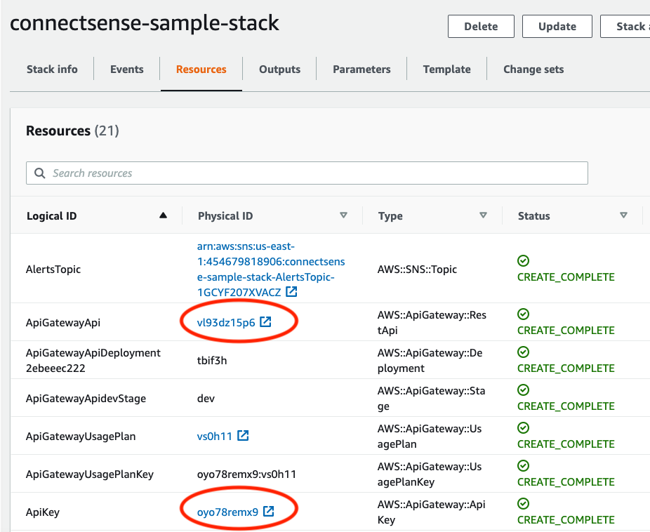
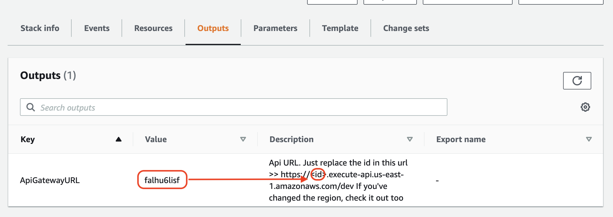

# Setting up AWS Infrastructure

This Quick Start builds an Internet of Things (IoT) energy monitoring solution and serverless architecture on the Amazon Web Services (AWS) Cloud in about 5 minutes.


You can use this Quick Start to automate the connection—and simplify the management—of thousands of energy monitoring devices through AWS IoT Core. You can also enable Amazon QuickSight .

The Quick Start includes a template and Config App to rapidly provision, connect, and manage supported energy monitoring devices to stream their output to AWS IoT Analytics in your AWS account.

The template creates resources in your AWS account to provision energy monitors as IoT things.

The Config App helps you register TrustFLEX ATECC608A Secure Element for AWS IoT Core Secure Authentication to your account. It also provides IoT certificates and other information necessary for supported cords to stream video content to AWS IoT Analytics.

The trust between the device identity and the cloud platform relies on a chain of trust. AWS IoT supports certificate-based authentication, but the trust in the device identity will depend entirely on how well the device’s private key is protected. If the private key is spoofed, the device can be impersonated by an unauthorized user who can then control the device’s transactions. However, adding authentication presents you with several challenges: securely storing the private key in the device, shipping the private key across the globe for any project and system size and ensuring a secure manufacturing flow. These challenges are addressed using the TrustFLEX ATECC608A-TFLXTLS secure element from Micropchip's Trust Platform.

## What You'll Build

Use this Quick Start to automatically set up the following serverless architecture on AWS:

  - A topic for subscribing to alerts
  - A Lambda function to create a provision things

## File System
- functions
    - packages: contains the sam builds for the Lambda Functions
    - source: contains the source code of the Lambda Functions
- templates: contains the template of the infrastructure in the Serverless Framework format (yaml)
- device-connection: contains the scripts to connect the device to the environment
- device-simulations: contains the scripts to fill the analytics with fake data

## How to deploy
In the Makefile, there's a list of commands that will help us to be deploying the app.

Also, we have a list of variables we need to set-up:
1. S3_BUCKET &rarr; The name of the bucket
2. stackName &rarr; The name of the CloudFormation stack
3. templatePath &rarr; The path of the original sam template
4. packagesPath &rarr; Path to the packages folder
5. sourcesPath &rarr; Path to the sources folder
6. ApiGatewayUsagePlanLimit &rarr; Is the number of requests the user will be allowed to make to the API Gateway each day (default is 10)
projectRoot &rarr; Name of the project root folder

If all the variables all correctly setted-up, the command `deploy-all-project` will create all the necessary steps to let this project setted-up
```shell
$ make deploy-all-project
```

The steps involved in this process are:
1. Create a new S3 bucket
2. Build the project
3. Upload all the project to S3
4. Package the sam project
5. Deploy the project


## Getting API endpoint and API Key

Once your stack has been deployed, open the CloudFormation console and select your deployed stack. In the "Resources" tab, find the resources with Logical IDs `ApiGatewayApi` and `ApiKey`, and open the links on their Physical IDs in two new tabs.

The identifier of the API endpoint is being shown in the output of the CloudFormation deployment but you can also get it from the console.



**If you go to the Outputs section** You will find the id of the API URL. In this example, the full url will be: https://falhu6lisf.execute-api.us-east-1.amazonaws.com/dev. Change it to match your instance. Copy and save this URL, which will be used by your device later to retrieve its credentials.



**In the Api Key tab** click "show" next to "API key"


## Connecting Your ConnectSense Device and Pushing Data

1. Go to `device-connection` folder (this project uses python3.8)
2. Install the dependencies
3. Fill the `conf-staging-example.txt` file with the data of your environment. You can find the `iotURL` with the command:
```bash
aws iot describe-endpoint --endpoint-type iot:Data-ATS
```
4. Connect the device that will run this script to the SoftAP of the device
5. Run the python script. `$ python cs-cord-dk-prov.py -h` will show the help section
6. `$ python cs-cord-dk-prov.py conf conf-staging-example.txt` will register your device in your AWS environment


## Building a QuickSight Dashboard with Your Data

1. From the console, navigate to the QuickSight service

2. Click on "New Analysis"

3. Click on "New DataSet"

4. Select the AWS IoT Analytics option

5. Select the AWS IoT Analytics DataSet created by your stack named "ConnectSenseQuickstartDataset"

6. Click "Create data source"

7. Click "Visualize"

8. Under the "Visual types" panel, select "Line Chart"

9. Click on the "Field wells" text at the top to expand the field wells.


10. Click and drag the field "datetime" into the X axis well

11. Click on the down arrow next to the `datetime` label and for Aggregate select "minute"

12. Click and drag the "watts" field into the "Value" well

13. Click on the down arrow next to the "watts" label and for Aggregate select "average"

14. Click and drag the "thing_name" field into the Color field

    * After completing steps 10-14, your Field wells should similar to this:


15. You will now be able to see the temperature plotted across time:


## Testing stack deployment Across Various Regions

We use [taskcat](https://github.com/aws-quickstart/taskcat) to test deployment in various regions and some simple fuzzing.

```bash
# install
pip3 install taskcat --user

# assume aws account credentials or use configured profile
taskcat test run
```

# Create simulation devices with analytics metrics
There's a folder named device-simulations, which have a certificate, a Pipfile and a sim.py file, that will be who'll create the devices and will send fake data to allow us to see analytics.

All that we have to do is go to the device-simulations folder, install `pipenv`, go to `device-simulations` folder and run `$ pipenv run python sim.py`

The rest of the documentation can be found in the README.md (manual for the user)


# To Clean Up Resources (AWS CLI)

Before removing the AWS CloudFormation stack, delete the policy created by this stack:
_default name: cord-stack-device-policy_
```bash
# remove policy
aws iot delete-policy --policy-name $POLICY-NAME
```

To remove the AWS CloudFormation stack you can use the script `clean-cloud` created in the Makefile: This deletes the S3 files, the S3 bucket, the AWS API Gateway REST API and all accompanying AWS Lambda and IAM roles originally created by the stack.

```bash
# delete stack
make clean-cloud
```

To remove the AWS IoT Thing all certificates must be detached.

If you don't already have your thing's name list all the things with `aws iot list-things`

1. list the certificates attached to the device
```bash
# list thing principals
aws iot list-thing-principals --thing-name $THING_NAME
```
_The result takes the form of a principal ARN. In the context of AWS IoT a
principal can be a thing group or a certificate. In our case the principal is
a certifate and the certificate's identifier is located after the forward
slash. We will need both_

`arn:aws:iot:region:account:cert/certificate-id`
                                \--------------/
                                 Certificate ID
  \------------------------------------------/
                     Principal

2. detach certificate from thing
```bash
# detach principal from thing
aws iot detach-thing-principal \
    --thing-name $THING_NAME   \
    --principal $CERT_ARN
```

3. remove thing
_certificates must be detached before delete_
```bash
# delete thing
aws iot delete-thing --thing-name $THING_NAME
```

4. list policies attached to certificate
```bash
# list principal policies
aws iot list-principal-policies --principal $PRINCIPAL
```

5. detach policy from certificate
```bash
# detach principal policies
aws iot detach-principal-policy --principal $PRINCIPAL \
    --policy-name $POLICY_NAME
```
_default name: cord-stack-device-policy_

6. remove the policy
_the default policy is used for all devices and is maintained in the cloud
formation stack_
```bash
# remove policy
aws iot delete-policy --policy-name $POLICY-NAME
```

7. remove certificate
_policies must be detached before delete_
```bash
# delete certificate
aws iot delete-certificate --certificate-id $CERT_ARN
```

# To Clean Up Resources (console)

If you used our AWS CloudFormation template for this tutorial, delete the associated AWS CloudFormation stack.

Sign in to the AWS Management Console and open the AWS CloudFormation console at https://console.aws.amazon.com/cloudformation.

In the search box, type the AWS CloudFormation stack name (for example, CodeDeployDemoStack).

Select the box beside the stack name.

In the Actions menu, choose Delete Stack. This deletes the stack, and delete all accompanying serverless resources.


## To delete the Amazon S3 bucket

Sign in to the AWS Management Console and open the Amazon S3 console at https://console.aws.amazon.com/s3/.

In the list of buckets, browse to and choose the name of the Amazon S3 bucket (for example, codedeploydemobucket).

Before you can delete a bucket, you must first delete its contents. Select all of the files in the bucket. In the Actions menu, choose Delete. When prompted to confirm the deletion, choose OK.

After the bucket is empty, you can delete the bucket. In the list of buckets, choose the row of the bucket (but not the bucket name). Choose Delete bucket, and when prompted to confirm, choose OK.

## To delete the AWS IoT Thing


Sign in to the AWS Management Console and open the AWS IoT console at https://console.aws.amazon.com/iot/.

__sign in with the same account or IAM user information that you used in the set up__

In the navigation pane, expand *Manage*, and then choose *Things*.

Choose your device.

In the navigation pane, choose *Security*.

Choose your certificate.

On the certificate card, toggle the drop down and choose *Detach*.

From the *Actions* drop down, choose *Delete*.

In the navigation pane, expand *Secure*, and then choose *Policies*.

Choose the policy.

Choose *Actions* and then choose *Delete*.

In the navigation pane, expand *Secure*, and then choose *Certificates*.

Choose the certificate for your device.

On the certificate card, toggle the drop down and choose *Delete*.
