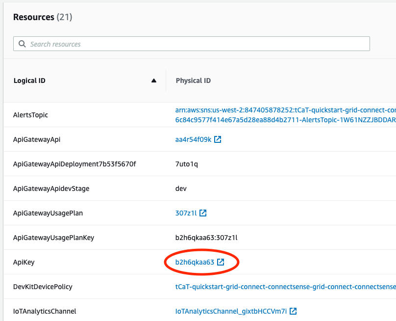
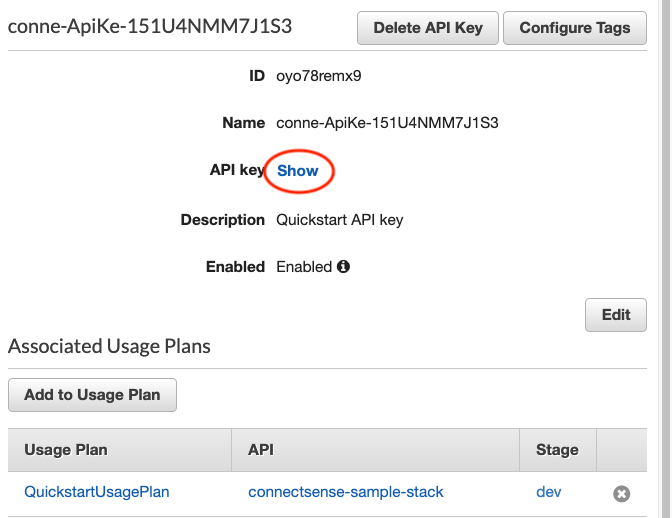
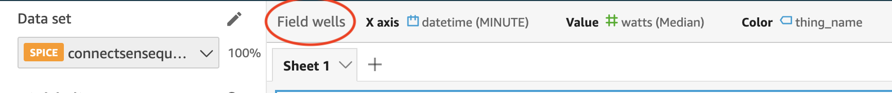
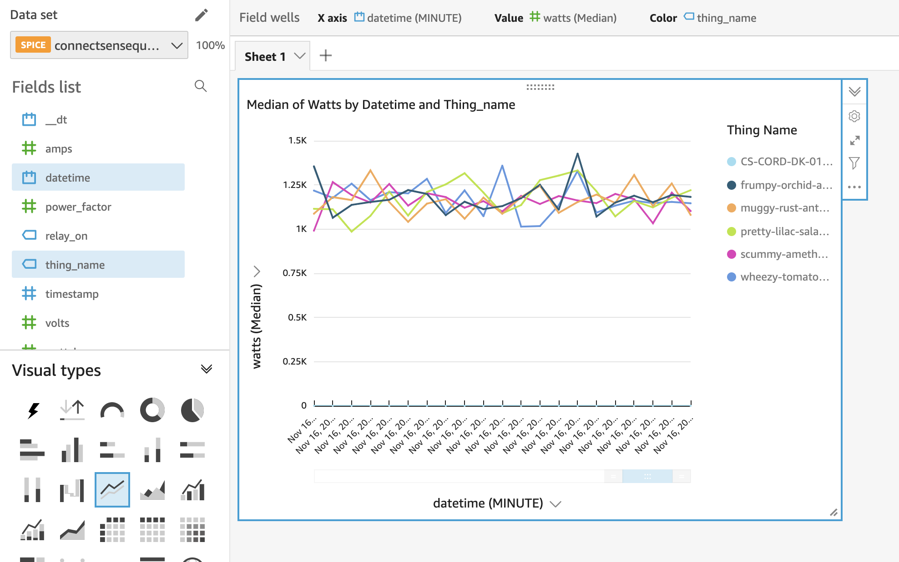

//TODO Marcia to add "start" notes to adjust numbering throughout.

:xrefstyle: short
== Post-deployment steps

Once the stack is deployed, you will need to retrieve the API Gateway URL and API Key to be able to configure your SPC. These values will then be added to the Python script used to configure the SPC. The script will need to be retrieved from the https://github.com/connectsense/quickstart-devkit-device-connection[ConnectSense Device Connection] GitHub repository.

=== Retrieve the API Gateway URL and API Key

To configure a SPC with your new IoT endpoint, you first need to retrieve the API Gateway URL and the API Key. Once retrieved, these values will be used to connect any SPC to the IoT Endpoint. 
To retrieve these values follow the steps below:
//TODO Done | Dylan, What context could we provide here? For example, what new endpoint are we talking about? And couldn't we have more than one device? What will we have accomplished at the end of this set of steps, and why are we doing it?

. Open the AWS CloudFormation console, and select your deployed stack. 

. Retrieve the API Gateway URL.
.. Choose the *Outputs* tab.
.. Copy the value of the *ApiGatewayURL* key, and save the value for use in configuring your SPC.

//TODO Done above | Dylan, Why are we retrieving this URL? Are we supposed to paste it somewhere?

. Retrieve the API key's physical ID.
.. Choose the *Resources* tab.
.. In the *Logical ID* column, find *ApiKey*, and choose its *Physical ID* link. For example, see the link circled in <<api-key-id>>.

[#api-key-id]
.AWS CloudFormation stack showing the link to the API key's physical ID
[link=images/cloudformation-stack.png]

[start=3]
.. Next to *API key*, choose *Show*, as shown in <<api-key>>. This reveals the ID value required for registering your physical device. Save this value for use in configuring your SPC.

//TODO Done above | Dylan, After we reveal this value, are we supposed to click it? Or copy and paste it somewhere, or otherwise do something with it?

[#api-key]
.API Gateway, API key
[link=images/cloudformation-apikey.png]

=== Configure the SPC with your new IoT endpoint

NOTE: The python script used for configuring your Smart Power Cord for AWS is maintained, and hosted by Connect Sense in their GitHub repository. 
It is therefore required that you navigate to their repository to retrieve the script.

To configure the SPC to connect to the AWS Cloud, download the https://github.com/connectsense/quickstart-devkit-device-connection[ConnectSense Device Connection repository^], which contains the python script to configure the SPC. You will need the *API Gateway URL* and the *API Key* retrieved above. Follow the steps in the ConnectSense Device Connection repository to configure your SPC.

//TODO Done - added a note | Dylan, What's the relationship between that DevKit repo and the Quick Start repo? We may need a bit of description here in this step, above, and maybe some description at the top of the section to help people understand this before they jump in on the steps.

=== Create an Amazon QuickSight dashboard

Amazon Quicksight can be utilized to create a dashboard to visualize the metrics from the connected SPC's. The steps below demonstrate setting up a dashboard for visualizing the watts used by the connected SPC over time.
//TODO Done | Dylan, What context would be helpful to set here for first timers? Remind us at a high level what we'll accomplish in this section and why we're doing it. Is this procedure below just an example? What else might people want to know or do to set up a dashboard?

If you are required to grant Quicksight access to AWS IoT Analytics, follow the steps in the https://docs.aws.amazon.com/iotanalytics/latest/userguide/data-visualization.html#visualization-quicksight[AWS IoT Analytics Data Visualization^] guide.

.    	From the AWS Management Console, open the QuickSight console.
.    	Choose *New Analysis*, *New DataSet*, *AWS IoT Analytics*.
.    	Select the AWS IoT Analytics dataset created by your stack named `ConnectSenseQuickstartDataset`.
.    	Choose *Create data source*, *Visualize*.
.    	In the *Visual types* panel, choose *Line Chart*.
.    	Choose *Field wells* at the top to expand the panel of field wells, as shown in <<field-wells>>.

//TODO Done - this requires some familiarity with QuickSight | Dylan, What are "field wells"?

//TODO Done - fixed | Dylan, Should this screen shot below show the "(MINUTE)" and "(Median)" already? We haven't told people to choose the aggregates yet. If these don't show yet, please replace this screen shot. If they do show already, do we still need to say, below, to choose "MINUTE"?

[#field-wells]
.Field wells
[link=images/quicksight-field-wells-activation.png]

[start=7]
. From the *Fields list*, drag the *datetime* label into the *X axis* field well. Choose the down arrow next to `datetime (MINUTE)`, and for aggregate, choose *minute*.
. From the *Fields list*, drag the *watts* label into the *Value* field well. Choose the down arrow next to `watts (Median)`, and for aggregate, choose *average*.
.	From the *Fields list*, drag the *thing_name* label into the *Color* field well.

//TODO Done - drag | Dylan, Do we drag labels from the Fields list or from the field-wells labels shown along the top?

//TODO Done - they are correct as is |  Dylan, in the UI, are the labels "minutes" and "average" uppercase or lowercase?

Your field wells now look something like <<field-wells-units>>.

//TODO Done - no, this is correct | Dylan, Should the y-axis below be labeled "watts (Average)" instead of "watts (Median)" since we chose "average" in the previous step?

[#field-wells-units]
.Field wells with units
[link=images/quicksight-field-wells.png]
image::../images/quicksight-field-wells.png[QuickSight field wells]

You now see the watts plotted something like <<quicksight-data-viz>>:

[#quicksight-data-viz]
.QuickSight data visualization
[link=images/quicksight-data-visualization.png]

//TODO Done - no, that was actuallyfor deployment and not testing. Not needed in this case | Dylan, The current readme file (https://github.com/aws-quickstart/quickstart-grid-connect-connectsense) has a section on testing. Should we include something on testing too?