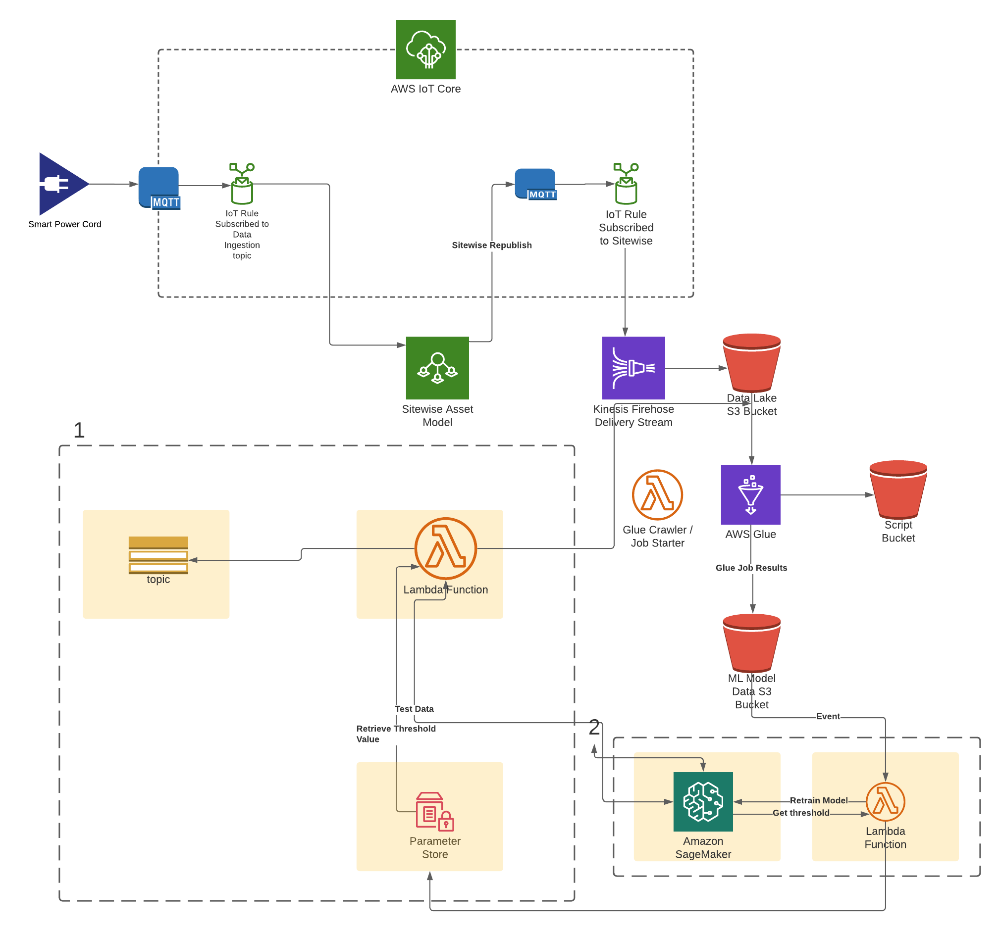

:xrefstyle: short

Deploying the Quick Start with the SiteWise addition with default parameters builds the following {partner-product-short-name} serverless IoT environment in the AWS Cloud.

[#architecture2]
.Architecture for the {partner-product-name} Quick Start SiteWise addition on AWS

As shown in <<architecture2>>, the Quick Start SiteWise Addition sets up the following:

* An AWS SiteWise asset model and asset
* IoT Rules to direct MQTT traffic into SiteWise
* S3 buckets to store raw and processed data
* ETL Pipeline to transform device data into training sets for an ML model
* A Lambda function that checks data as it is ingested to see if it is anomalous
* SSM parameter to store the anomaly score threshold