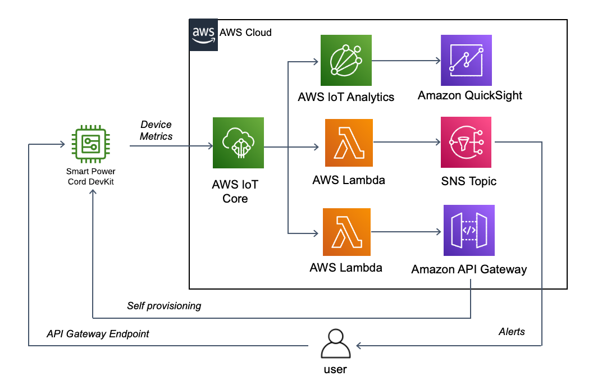

Deploying this Quick Start for a Serverless IoT Backend with *default parameters* builds the environment illustrated in Figure 1 in the AWS Cloud.

:xrefstyle: short
[#architecture1]
.Quick Start architecture for SPC on AWS

The Quick Start sets up the following serverless architecture:

* An AWS API Gateway deployment for ConnectSense devices to self-provision
* An AWS Lambda Function for provisioning devices 
* An AWS Lambda Function to generate alerts sent to a Simple Notification Service (SNS) topic
* A Simple Notification Service (SNS) topic for publishing alerts
* IAM Roles for the AWS Lambda Functions
* AWS IoT Analytics Pipeline, Channel, Datastore, and Data Set for data processing
* An Amazon Quicksight dashboard for data visualization
