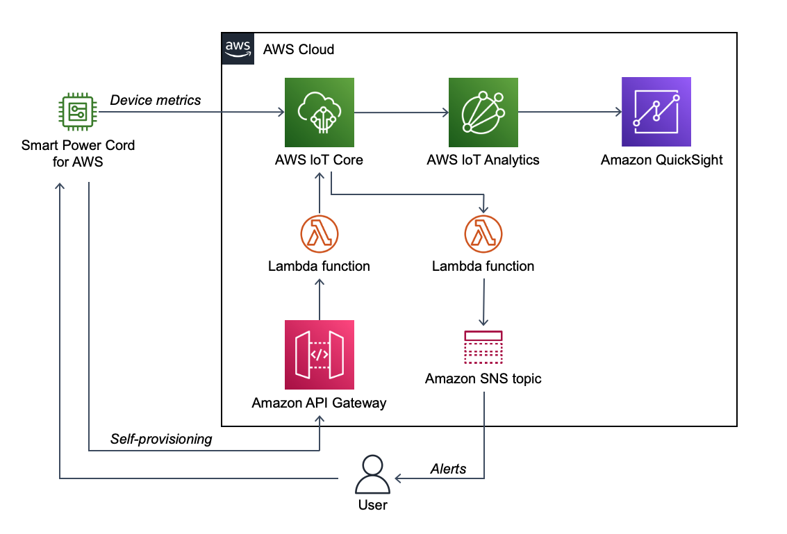

:xrefstyle: short

Deploying this Quick Start with default parameters builds the following {partner-product-short-name} serverless IoT environment in the AWS Cloud.

[#architecture1]
.Architecture for the {partner-product-name} Quick Start on AWS

As shown in <<architecture1>>, the Quick Start sets up the following:

* Amazon API Gateway for ConnectSense devices to self-provision.
* An Amazon Simple Notification Service (Amazon SNS) topic for publishing alerts.
* AWS Lambda: one function to provision devices and one to generate alerts to send to the  Amazon SNS topic. The Lambda functions require AWS Identity and Access Management (IAM) roles created by the Quick Start.
* AWS IoT Core for your {partner-product-short-name} to publish device metrics.
* AWS IoT Analytics pipeline, channel, data store, and dataset for processing the {partner-product-short-name} metrics.
* An Amazon QuickSight dashboard for data visualization.