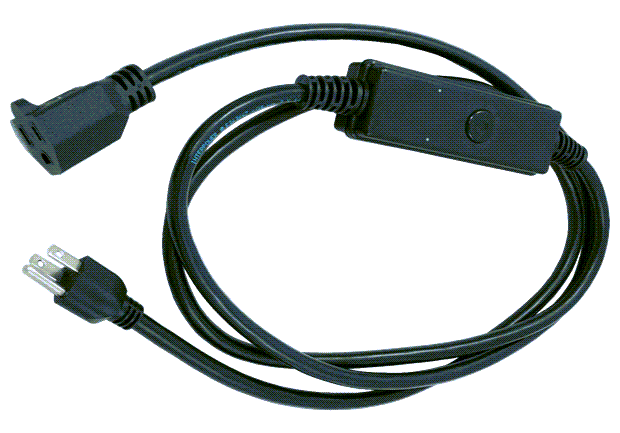

:xrefstyle: short

You can use this Quick Start with the {partner-product-short-name}, shown in <<spc>>, to connect your legacy edge devices and machines—such as motors, pumps, compressors, electric cars, or IT equipment—with an IoT architecture on AWS. You can ingest power-related metrics from any 110-VAC or 240-VAC device into AWS IoT Core.

[#spc]
.The {partner-product-name}

This Quick Start works with a model of the {partner-product-short-name} that's designed for AWS. Here are some examples of things you might do with this deployment: 

* Monitor power.
* Turn power on or off remotely.
* Reboot remotely.
* Sense usage.
* Provide data that leads to better maintenance schedules. 
* Power cycle a load on or off.
* Read voltage.
* Read current in amps.
* Read the power factor.
* Get a calculated value for the watt-hours.
* Monitor and control pumps, commercial appliances, and electric-vehicle chargers. 
* Reduce electricity consumption by switching off the power supply to groups of customers (load shedding) when the entire system is at risk.

//TODO Dylan, In this preceding bulleted list, I've consolidated all the use cases mentioned in the previous draft. Please pick the best examples, deleted the rest, and rearrange as you see fit.

The {partner-product-short-name} uses a Secure Element authentication chip that's preloaded with credentials to help you provision your cloud application securely.

The Quick Start uses several AWS services that give you a way to test your {partner-product-short-name} against a realistic backend application. You can augment the Quick Start with additional services and features to create a full-fledged, production-grade application.

For general information on ConnectSense smart-home devices, see the https://iot.connectsense.com/[ConnectSense website^]. For details on the {partner-product-short-name} for AWS, see [product link page?]

//TODO Waiting on that link from the partner. We'll add this at the last minute.